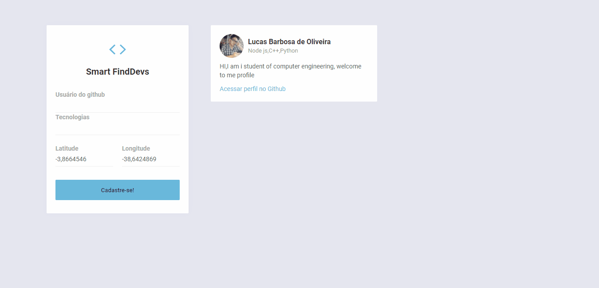

## Front-end web Smart DevFinder
<p align="center">
<strong>React js aplication for register devs for a mobile search service</strong>
</p>
<p align="center">
  
  <a aria-label="React Version" href="https://github.com/facebook/react/blob/master/CHANGELOG.md#16120-november-14-2019">
    </img>
  </a>

</p>

To init the Frontend aplication in React, do the follow lines:
```bash
cd web-devfinder
yarn install
yarn start
```
After this, the React will load a the aplication on the page `localhost:3000`
  


